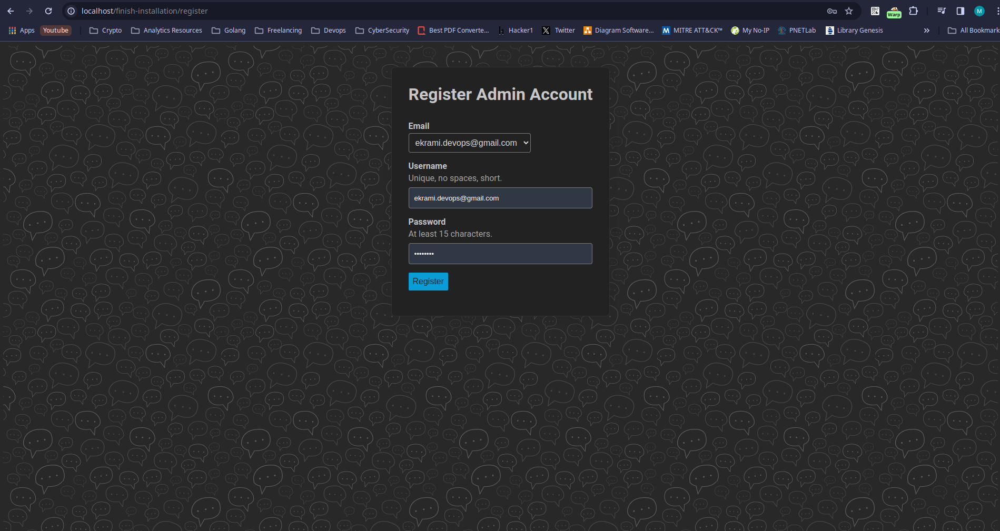
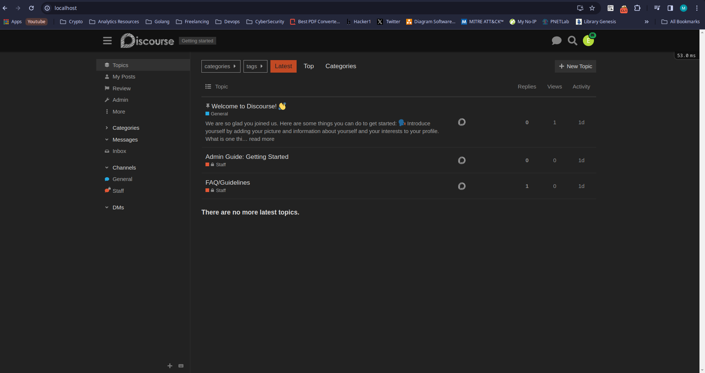

# interview
this is a temp repo for an interview
# Running Discourse App Locally with Docker

To run the Discourse app locally using Docker, follow these steps:

1. **Clone the Repository:**
   - Clone the `discourse/discourse_docker` repository into your local environment:
     ```bash
     git clone https://github.com/discourse/discourse_docker.git
     ```

2. **Navigate to the Directory:**
   - Go to the cloned repository directory:
     ```bash
     cd discourse_docker
     ```

3. **Choose Configuration:**
   - Decide whether you want to run the app as a single-container or multi-container setup.

4. **Configure Environment:**
   - If needed, customize the configuration files in the `samples` directory according to your requirements.

5. **Run Docker Templates:**
   - The `discourse_docker` utilizes a templating engine written in Ruby to create Docker templates for running containers.
   - Explore the templates available in the `samples` directory to understand the configuration options.
   - You need to copy the sample[s] you desire to the container directory for example:
   - `cp samples/standalone.yml containers/`
   - with this way the launcher would render the template and builds the image with exact same name of filename.

6. **Single-Container Setup:**
   - For a single-container setup, you'll typically use the `standalone.yml` template.
      Or you can start from scratch using `./discourse-setup` which prompts you to set your environment variables and automatically bootstraps a base image.

7. **Multi-Container Setup:**
   - For a multi-container setup, you'll utilize templates such as `web_only.yml`, `data.yml`.

8. **Build and Run Docker Containers:**
   - Copy the samples such as `web_only.yml` and/or `data.yml` to the containers folder.
   - Use Launcher to build and run the Docker containers based on the chosen configuration.
     ```bash
     # For a single-container setup
     ./launcher bootstrap standalone
     ./launcher start standalone
     
     # For a multi-container setup
     # First the web_only which are frontend and backend (business layer)
     ./launcher bootstrap web_only
     ./launcher start web_only
     # Then data layer (Postgres + Redis)
     ./launcher bootstrap data
     ./launcher start data
     ```

9. **Change the environment variables**
    - Tweak the ENV variables on containers/<template.yml> such as SMTP_* to the actual SMTP server and SMTP username.
 ```bash  
  DISCOURSE_SMTP_ADDRESS: smtp.gmail.com
  DISCOURSE_SMTP_PORT: 587
  DISCOURSE_SMTP_USER_NAME: someone@gmail.com
  DISCOURSE_SMTP_PASSWORD: "SecurePassword"
  DISCOURSE_SMTP_ENABLE_START_TLS: true           # (optional, default true)
  DISCOURSE_SMTP_DOMAIN: gmail.com
  DISCOURSE_NOTIFICATION_EMAIL: noreply@localhost
  ```
10. **Access the Application:**
   - Once the containers are running, access the Discourse application by navigating to `http://localhost:80` in your web browser.
    

11. ***Email Verfication***
If you are using a self hosted SMTP you are most likely fine to go. However using gmail as SMTP relay is complicated due to security implementations by Google.
the easiest way i found was this HaCkY method:

1. Attach to the container terminal that hosts Postgres database in my standalone case: 
`docker exec -ti standalone bash`
2. login as postgres user:
`su postgres`
3. connect to the database and change some records:
```bash 
psql
\c discourse;
update users set active=TRUE where username = '<your_username>';
update email_tokens set cnofirmed=TRUE where email = '<your_email_address>';
```
4. Check the admin panel on localhost/admin. You should see a page like this


# Running Workadventure App Locally with Docker
To run the Workadventure app locally using Docker compose, follow these steps:

1. ***Clone the Repository***
```bash
git clone https://github.com/workadventure/workadventure
```

2. ***Remove all node_modules***
during the build time, npm dose not allow any external node_modules directory to be available.
you need to find all the node_modules and delete them. use this command:
```bash
find . -name "node_modules" -type d --exec rm -rf {} +
```
3. ***Build and run the containers***
Copy `.env.example` to `.env` and change the env variables to desired state.
run `docker compose up -d` to build and run the containers
4. ***Change the host file***
The reverse proxy service uses `HostPath({domain})` to route the traffic into the coresponding service.
so you need to change the `/etc/hosts` file on your local machine (this is of course for dev environment)
```bash
127.0.0.1 traefik.workadventure.localhost play.workadventure.localhost
```
the `traefik.workadventure.localhost` is for monitoring the services and checking out HTTP Routes.
the `play.workadventure.localhost` is for application itself

4. ***Access the Application***
browse to `play.workadventure.localhost` and set your username. The Workadventure is up and running.

